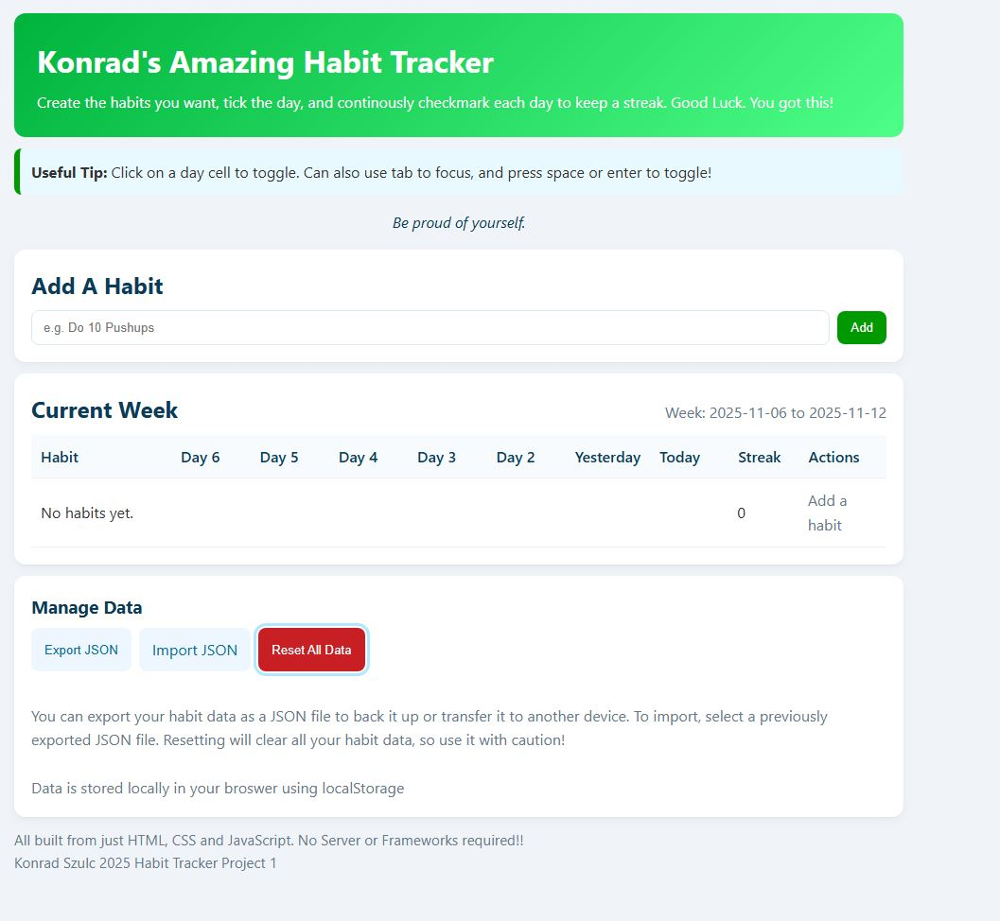
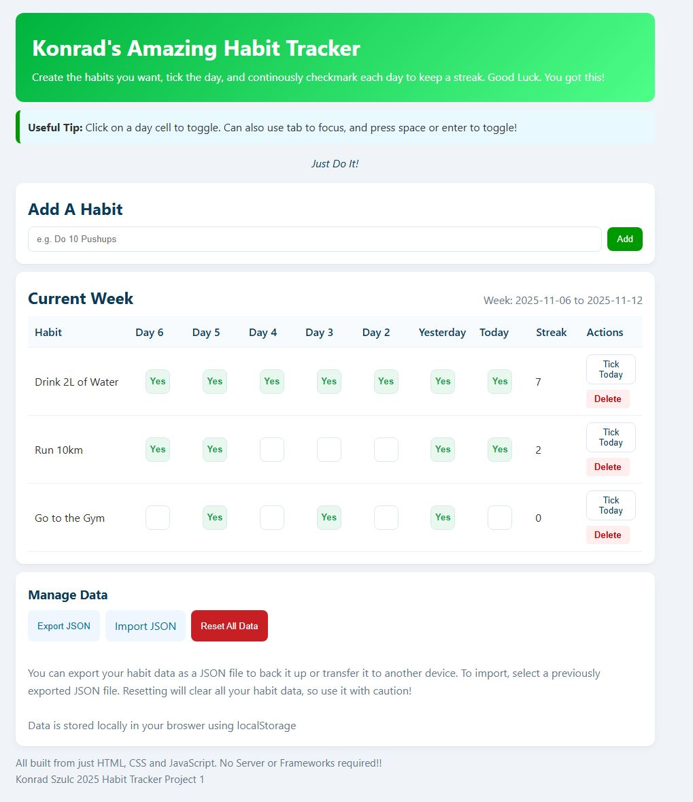

# **Konrad's Amazing Habit Tracker**

Welcome to My Habit Tracker Repo. This was a project for my Dynamic Web Applications with JavaScript Course. It includes a handy site to store, motivate, and keep track of habits worth tracking for the last 7 days. You can add or delete a habit, mark days that have been completed, and watch as the counter for streak goes up. All saved to the local browser storage, that can then be made into JSON file if so desired. It can import JSON files to view old kept logs of what habits you did, and if want to save a log, then export a JSON file as well. You do not want any? well Delete it all and reset the whole table/local storage. 

## Key Features

In a simplified way the key features of the site are:

1. Add or Deleting Custom Created Habits to track
2. Tick Days where it was completed 
3. Collects current streak of days
4. Stores locally in browser, does not reset entire table on refresh
5. Can export JSON of the locally saved Data for back up
6. Can import JSON files to view previous
7. Reset all data if so desire
8. Added bonus of motivational quotes on each refresh

## Project Structure

```
habit-tracker/
├── index.html             # Main HTML file
├──assets/
│   └──  styles.css        # CSS styles
├── js/
│   └── app.js             # Main JavaScript file
├── screenshots/
│    ├── emptyRender.JPG       # Example of site with no data
│    └── examplesRender.JPG    # Example of site with data
└── README.md              # Project documentation
```

## How Can I run it? 

Please Use the following Github Pages link: https://konradszulc.github.io/habit-tracker/
which will work for either Mac or Windows

if preferred to use locally:
1. Save all files to your local computer/Clone Repository

```bash
git clone https://github.com/your-username/habit-tracker.git
```

2. Open index.html in your preffered browser
3. See console output by opening browser developer tools to verify if errors. Shortcuts for Windows/Linux: Press F12 or Ctrl + Shift + I. Shortcuts for Mac: Press Cmd + Opt + I
4. Enjoy using the site, view demo video for explanation on how it works.

Below includes some screenshots of how the site should look on first render, and after potential habits are added.

## Screenshots

Site Empty Data


Site With Data


## Self Assessment

### Core Functionality

- Primary User Stories: No Blockers present, succeeds all stories. 4 points
- Error Handling: includes validation in the form not allowing empty habit, alerts user when deleting, and shows error alert if wrong file. 2 points
- State and Navigation: localStorage is presistent even after refresh, toggles and habits added as well. 2 points
- Empty and Loading States: there are no spinners for loading, but when table is empty displays information to prompt user. 1.5 points

Total: 9.5 points (1 Excellent)

### Code Quality and Architecture

- Small Functions: Clear seperation of HTML, CSS, and JavaScript, functions are clear in code to increase the maintainability of the code. 2 points
- Naming and Comments: Variable names are clear, Class names and IDs are created with relevance, Comments are added to most lines for clarification and learning/revising purposes, though can be too much comments. .5 point
- Consistency: Formatting is consistent across all files. 1 point
- Defensive Coding: JS will check localStorage if null or not, as well uses try/catch in import and export JSON functionality. 1 point

Total: 4.5 points (1 Clean & Coherent)

### UX and Accessibility

- Responsive Layout: Visually striking and designed for multiple devices/sizes, Has scrollTable to allow for the table to be visible even on a mobile device, no overflow. 1 point
- Keyboard Support: allows ability to focus and toggle with keyboard navigation, shows border and visible clarity of using keyboard. 1 point
- Form Usability: Has placeholder text, and validation if field empty, however, can duplicate habits if user inputs improvement for next time. .5 points
- Contrast and Semantics: Using proper elements to display proper structure to user, uses proper css styling to show difference in sections for better usage. 1 point
- Perceived Performance: no layout shifts, but also no spinners or skeletons, runs smoothly and quick almost unnoticeable renders. .5 points

Total: 4 points (2 Minor Gaps)

### Data Handling and Persistence

- Reads and Writes Safely: localStorage is used to be consistent even on refreshed, delivers suitable JSON file when exported, and reads imported suitable JSON without issues. 1 point
- Schema Awareness: Checks state of habits array when importing, and if empty in local storage, will show default table. 1 point
- Security Hygiene: Many instances of using textContent instead of innerHTML to avoid script injection in dynamic rendering. 1 point
- Resilience: try/catch are used when importing JSON files, handling if wrong file type selected or unavailable data. 1 point

Total: 4 points (1 Safe and Reliable)

### Documentation

- README Completeness: Contains features, structure,screenshots, instructions to run site, self assessment and reflection. 1 point
- Clarity: Provides the key features, with project structure to navigate, and in reflections mentions some limitations. .5 point
- Reflection & Self-Assessment: Through reflection with considerable effort, and created self assessment for each section. 1 point

Total: 2.5 points (1 Complete & Clear)

### Deployment

- Live URL: Deployed to GitHub pages, works as intended. Repo is public. 1 point
- Consistent Links: GitHub Pages link in how to run it section of README. Links have been verified. 1 point
- Release Hygiene: no optional tag, or release note or simple CI. 0 points

Total: 2 points (2 Live with Minor Issues)

### Demo Video & Project Documentations on Git

- Structure and Clarity: Does follow logical order of problem, solution and result, no additonal flair to presentation. 1.5 points
- Evidence: Video demonstrates live results and functionality. 1 point
- Reflection: Demonstrates some key parts of code indivdual used and what to improve. 1 point
- Delivery: Clear audio, and screenshare, no webcam, duration about 5 minutes. Timestamps are listed in README. .5 points

Total: 4 points (2 Clear with Minor Gaps)

### Total Points

Overall Points = 30.5/35

## Reflection

Understanding and going through the process of creating this project was very useful to witness and put the various skills learned throughout this course. The ability to use different DOM manipulation, dynamically altering the page in a seamless and smooth transition. Utilizing events to make the page interactive to the users’ inputs, and as well to display various feedback to the user like alerts. Effectively creating visually striking application, with accessibility support such as screen reader or keyboard control, mobile view is essential to be inclusive to everyone in this day and age, especially with technology. The ability to store data locally on the browser, understand how it is stored, to then pull up that data in different functions or to export to JSON is beneficial to future projects. As a unique feature wanting to better show my understanding of how to access different elements on the page, by including a unique motivational quote display, that is random each time the page renders. There is still much more to learn, such as being able to also potentially implement BOM, to create different pages of navigation such as a login to have the tracker be for specific individuals. As well, to potentially add goals for users, that is then tracked real time to reach their goals with a progress bar, like run a total of 25km in a week.

A challenge I faced was the debugging process, as sometimes, code can miss some syntax or variables can be spelt differently in other places of code, thus preventing the code from running properly without easy way to notice. Using console.log was helpful to understand if a variable received the data it was intended to receive, allowing to narrow down the source of the issue. As well, if there was an error consistently having the developer tools open to notice any strange behavior in the site runtime. Furthermore, I would also want to improve styling a bit, to have less inline styles, while I tried to create more important styles in seperate sheet, it was also effective for me to use inline for smaller elements, but for the future, best to have more consistent styles in a styles sheet. Lastly, commenting is very important for future reference or for others viewing work to understand certain pieces of code, while I write lots of comments now is for the benefit of learning to practise getting better at coding, but for future reference such extensive commenting can also be time consuming and wasteful for professional projects. It is important to keep in mind, short and to the point and not as extensive breakdowns of code. Overall, this beginning in depth yet simple project was a great way to put my knowledge of the usefulness of JavaScript to the test and look forward to potential future projects that can utilize this experience!

## Video-Time Stamps

While there is no video link in the public Repo, those who have received the video link can use this section to know which parts are addressed through these time stamps:

00:00 Introduction and problem fixed with Habit Tracker


